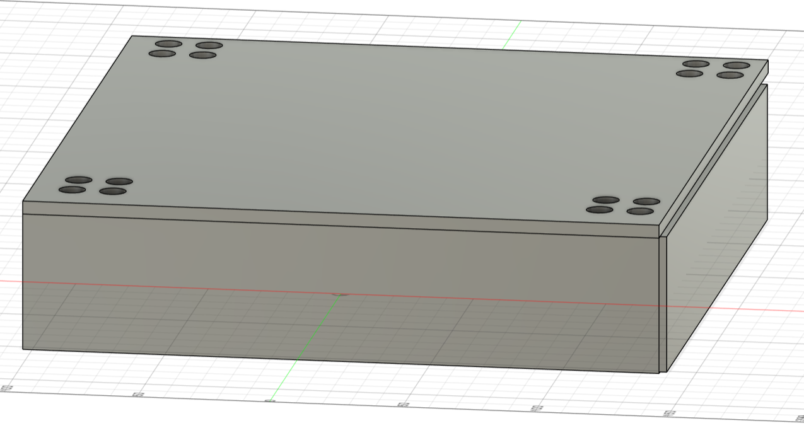
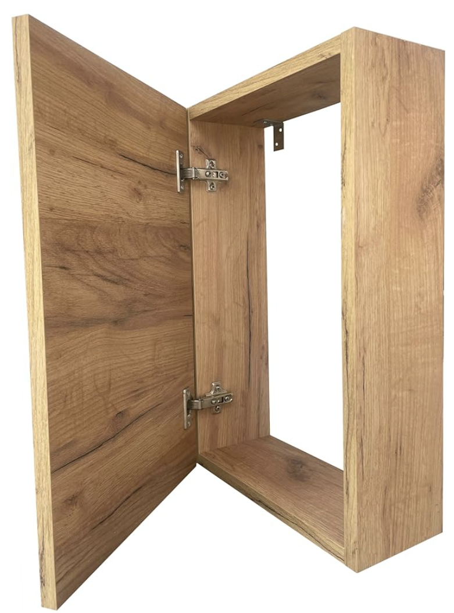
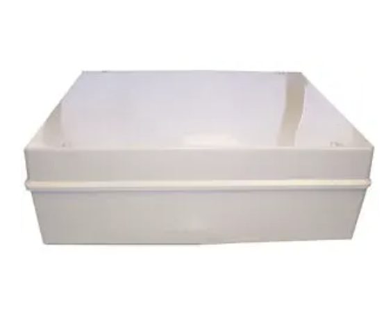

# Behuizing

Om de Mini-PC en Raspberry Pi 5 in de fietsenstalling te kunnen plaatsen, moesten we een behuizing maken. Voor dit deel van ons project hadden we enkele ideeën

## Idee 1 : Creatie eigen behuizing (3D printen)

Voor ons eerste idee dachten we eraan om zelf een behuizing te maken met een 3D-printer. Dit bracht echter enkele problemen met zich mee, zoals: onvoldoende waterdichtheid, beperkte stevigheid en de beperking dat de 3D-printer niet groot genoeg kan printen, waardoor de constructie niet stevig zou zijn.

## Idee 2 : Creatie eigen behuizing (Hout)

Een andere oplossing was om de behuizing van hout te maken. Hoewel dit steviger is, blijft het probleem bestaan dat het niet echt waterdicht is en gevoelig is voor vocht, waardoor het uiteindelijk geen goede oplossing bleek te zijn.

## Finale Idee : Behuizing

Uiteindelijk zijn we, in overleg met onze project owner, tot de beslissing gekomen om een plastic behuizing te kopen. We kozen voor een model dat waterdicht en stevig is, zodat we het kunnen gebruiken en indien nodig nog aanpassingen kunnen doen.
