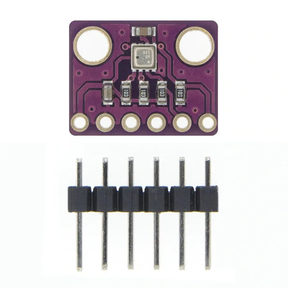

# ESP32

# Sensoren
Een iets ruimere uitleg over de sensoren die worden gebruikt in dit project:

## Temperatuur, vochtigheids & luchtdruk
- **Sensor**: BME280

- **Uitleg**: Deze sensor kan Temperatuur van  -40°C tot 85°C meten, luchtvochtigheid van 0% tot 100% RH  en luchtdruk van 300 hPa tot 1100 hPa meten. Deze sensor werkt op een voeding van 3,3V en kan communiceren via I2C en SPI. De sensor is zeer gevoelig voor veranderingen in de omgevingsomstandigheden, en biedt daardoor nauwkeurige metingen. Met de prijs van €6,85 is dit een goede prijs/kwaliteit verhouding.
- **Waarom deze sensor?**: Deze sensor is makkelijk te integreren. De prijs/kwaliteit verhouding is ook zeer goed waardoor we het budget van dit project wat lager kunnen houden.
- **Bronnen**:
    - [Verkooppagina](https://www.otronic.nl/nl/3-in-1-sensor-temperatuur-luchtvochtighe-140567441.html)
    - [Documentatie](https://esphome.io/components/sensor/bme280.html)
## CO2 sensor
- **Sensor**: MH-Z19

- **Uitleg**: Deze sensor maakt gebruik van NDIR (Non-Dispersive Infrared) technologie om de CO₂-concentratie te meten. Een infrarood lichtbron zendt licht uit in een gaskamer, waar CO₂-moleculen specifieke golflengtes absorberen. Een fotodetector meet hoeveel licht er passeert en de sensor berekent de CO₂-niveaus.
- **Waarom deze sensor?**: We kiezen voor deze sensor omdat deze gezien wordt als één van de beste CO₂ sensors binnen een budget. Deze sensor is ook zeer goed gedocumenteerd waardoor het integreren net wat gemakkelijker is.
- **Bronnen**:
    - [Verkooppagina](https://www.otronic.nl/nl/co2-sensor-mh-z19b-met-kabeltje.html)
    - [Documentatie](https://esphome.io/components/sensor/mhz19.html)
## Lichtintensiteitssensor
- **Sensor**: BH1750 16-bit I2C

- **Uitleg**: Dit is een low-power sensor die ambient light meet door gebruik te maken van een photodiode. Deze sensor heeft een bereik van 1-65535 LUX, dit bereik is goed voor on maar als je moet meten in extreem felle omstandigheden kan dit meetbereik een probleem zijn. Maar voor dit project is dit niet van toepassing. 
- **Waarom deze sensor?**: Deze sensor is goed gedocumenteerd waardoor deze makkelijk te integreren is. De sensor geeft ook direct een LUX waarde zonder dat je extra berekeningen moet uitvoeren zoals bij sommige andere lichtintensiteitssensoren.
- **Bronnen**:
    - [Verkooppagina](https://www.otronic.nl/nl/lichtintensiteitssensor-bh1750-16-bit-i2c.html)
    - [Documentatie](https://esphome.io/components/sensor/bh1750.html)

## Bodemvochtigheidssensor
- **Sensor**: Adafruit STEMMA Soil Sensor - I2C Capacitive Moisture Sensor

- **Uitleg:** Deze sensor werkt als een condensator. Je hebt twee geleidende platen met daartussen een middenstof die een bepaalde diëlektrische constante heeft. In het geval van deze sensor is dat de grond van de planten. Hoe droger de grond, hoe lager de capaciteit. Hoe natter de grond, hoe hoger de capaciteit wordt. Zo berekent de sensor de bodemvochtigheid.
- **Waarom deze sensor?** We hebben deze sensor gekozen omdat deze niet kan roesten en ook het best past binnen ons budget. De betere keuze zal altijd een resistive soil moisture sensor zijn maar als je deze op een budget wil kopen zit je aan een prijs van €150-€200+
- **Bronnen**:
    - [Verkooppagina](https://www.kiwi-electronics.com/en/adafruit-stemma-soil-sensor-i2c-capacitive-moisture-sensor-10395?srsltid=AfmBOooJ1g1CV7B6sW7FP40MrxXvbrV9gMzO7DyCYZOQxJjlGE7Xx_X6)
    - [Documentatie]()