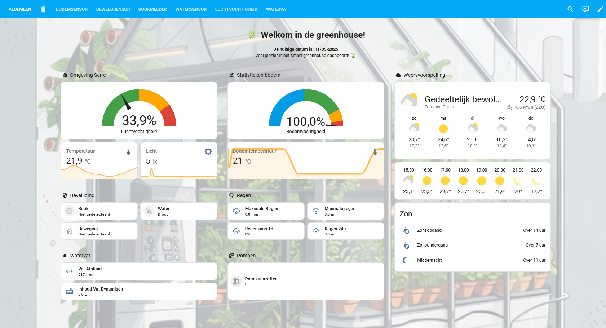
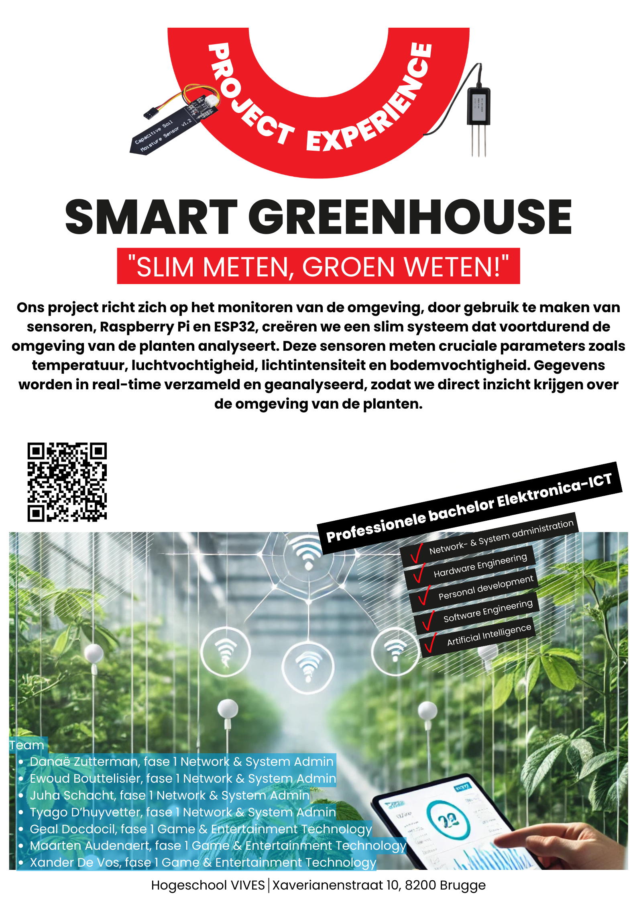
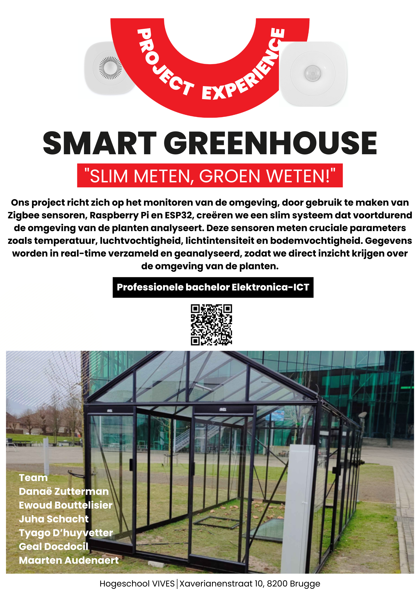
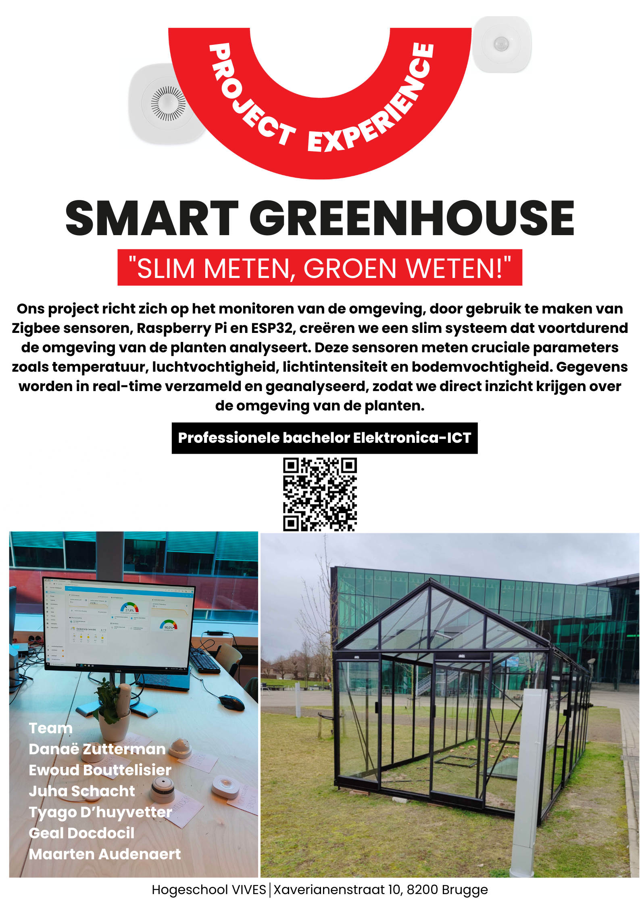

# Smart Greenhouse
## Inhoudstafel
- [Team](#Team)
- [Doel](#Doel)
- [Technische aanpak](#Technische-aanpak)
- [Affiches](#Begin-en-Eind-Affiche)
- [Extra Info](#Extra-Info)

## Team
Het team van Smart Greenhouse bestaat uit:
- [Didier Vereecke](https://github.com/MrI2C): Projectleader
- [Alexander D'hoore](https://github.com/AlexanderDhoore): Scrum-master
- [Juha Schacht](https://github.com/Jschacht06)
- [Geal Docdocil](https://github.com/Gdoc141)
- [Ewoud Bouttelisier](https://github.com/EwoudBoutje)
- [Danaë Zutterman](https://github.com/Danaezutterman)
- [Tyago D'huyvetter](https://github.com/TyagoD)
- [Maarten Audenaert](https://github.com/MaartenAudenaert)

## Doel
  Het hoofddoel van ons is om een slim systeem maken dat in staat is om de serre te monitoren en het automatisch aan te passen.
  Door gebruik te maken van sensoren en pompen kunnen we parameters zoals luchtvochtigheid, temperatuur, bodemvochtigheid en lichtintensiteit in real-time worden gevolgd en aangepast.
  Dit zorgt ervoor dat je zelf de serre niet de hele tijd in de gaten moet houden.

## Voorstelling van het project
 

## Technische aanpak
Het systeem maakt gebruik van zowel hardware als software:

- **Sensoren**: om de omgevingsparameters zoals temperatuur, luchtvochtigheid, bodemvocht en lichtintensiteit te meten.
  
- **Microcontrollers**: zoals de Raspberry Pi en de ESP32 om de gegevens te verzamelen en te verwerken.

- **Pompen**: om automatisch water aan de planten te geven bij droogte.

- **Dashboard**: een gebruiksvriendelijke interface waar alle gegevens worden getoond, en waar je bepaalde onderdelen kan wijzigen.

## De Serre en het Dashboard

   
    
  

## Begin en Eind Affiche

   
    
    

## Extra Info

| Onderdeel   | Inhoud                                 |
|:------------|:----------------------------------------|
| [**Hardware**](/Hardware)   | Info over hardware & sensoren             |
| [**Software**](/Software)   | Codevoorbeelden & Home Assistant setup   |
| [**Schema's**](/Schema's)   | Overzicht van ons project in schema's    |
| [**Behuizing**](/Behuizing) | Info over de behuizing van het project   |
| [**Datasheets**](/Datasheets) | Technische fiches van de gebruikte producten |
| [**Netwerk**](/Networking)  | Details over het gebruikte netwerk       |
| [**Research**](/Research)   | De onderdelen die we onderzocht hebben        |
| [**Advertisement**](/Advertisement)   | Onze gemaakte affiches en instagram posts        |

